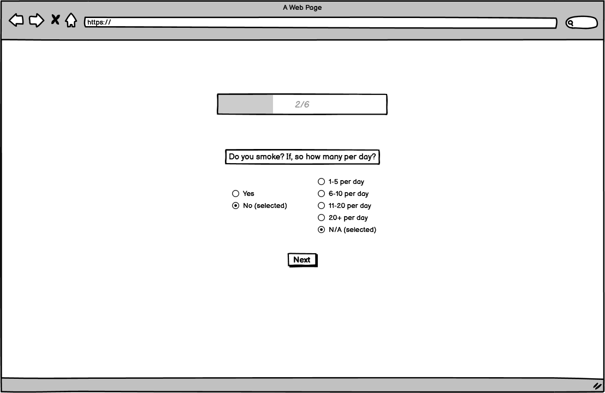
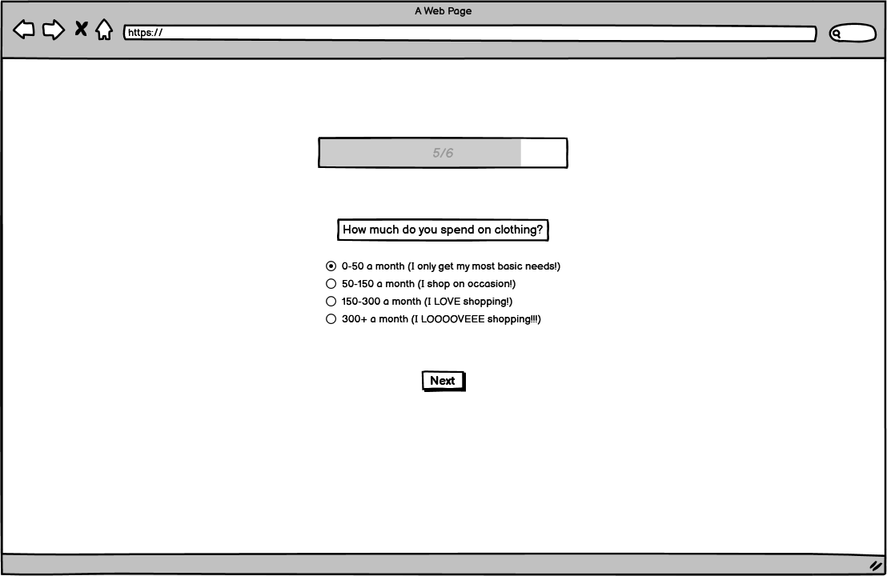

# Project Tittle

**Table of Contents:**
---
---

* [Project Description](#project-description)
    * [Concept](#concept)
    * [Intention](#intention)
    * [Audience](#audience)
* [Wireframes](#wireframes)
    * [Initial Wireframes](#initial-wireframes)
    * [Final Wireframes](#final-wireframes)
* [Features](#features)
    * [Header](#header)
    * [Footer](#footer)
    * [Unified colour scheme](#unified-colour-scheme)
    * [Navigation](#navigation)
    * [Progress Bar](#progress-bar)
    * [Personality Questions](#personality-questions)
    * [Currency Converter](#currency-converter) 
* [Accessbility](#accessibility)
* [Design Choices](#design-choices)
    * [Font](#font)
    * [Images](#images)
    * [Widgets](#widgets)
    * [Colour Schemes](#colour-scheme)
* [Code Explanations](#code-explanations)
    * [HTML](#html)
    * [JavaScript](#javascript)
    * [API](#api)
    * [Materialize/Bootstrap?](#materialize/bootstrap)
* [Bugs](#bugs)
* [Deployment](#deployment)
    * [User Interaction](#user-interaction)
* [Testing](#testing)
* [Credits](#credits)

---

## Project Description 
---

Collectively as a group we pitched different ideas to each other, in response to the theme revolutionsing finance for 2023. A key challenge was being able to identify the ideas that would best marry up, with our time schedule. After realising some ideas would be overly ambitious, we concluded that there could be ingenuity in simplicity. 

Hitting upon our idea, we delved further into how we could ensure that we solved a **problem**, and responding to this, with the implemntation of our tech skills. We discussed how our potential target audience could be handling budgeting, at a time where our living standards are suffering, because of the cost of living and energy crisis. Everyone has had to be a bit more thrifty and cut back where they can. What we wish to achieve is a budgeting app, that uses visual representations, to enable the indiviudal to make better choices on how they spend and save their money, over a peroid of time. 

Initially the user will sign up to the application and take a personality test, this will allow a randomiser to generate user specific visuals from their answers. For instance over a peroid of a week how often do you buy a cup of coffee, in turn this will generate the weekly cost in either sterling, dollars or euros. In order to have reall time exchange values we have used an api .... 

### Concept 

The project seeks to help its users by identifying some personality and lifestyle spendings that can be cut down to build up savings to achieve a target goal within a desired time.

---

### Intention

As highlighted by the theme there is a need for radical change inorder to put more aside and to get more things done financially. The project seeks to help users achieve more by setting aside bits of their spendings. This is to be done in a fun and engaging way and providing different suggestions on what can be done.

---

### Audience

Our target audience would be those predominantly feeling the pinch, as a result of the cost of living crisis. Communicating in a fun and engaging way is key to how we will respond to our potential user basis's concerns and needs. Taking a less serious approach would act as ice breaker, making the world of finance feel a bit more digestable to the every day joe.

---

## Wireframes

---

### Initial Wireframes

---

##### Wireframe 1 description: 

The first frame test the intension of the user to save and how much he will like to save a particular period. It includes a progress bar and a nav bar to enable the user identify how far he is to getting the suggestions on improving his savings. The user is able to choose his desired currency.
After showing intrest, the user is able to use the next button to start the process.

The second frame shows an increasing progress bar with question to how much the user desires to save and it presents a toggle button to switch between months and days.

The third frame is displayong a question that relates to lifestyle habit to guage their consumption, the user is able then able to proceed to the next question.

The fourth frame guages further lifestyle habit to also guage consumption, the user is then able to proceed to the next question.

The fifth frame ask about the consumption of coffee by the user as an input to the randomization figures using radio buttons to indicate true or false and also to indicate the amount of times, the user is able then able to proceed.

The sixth frame seeks about the users spending on luxuries, here the progress bar shows almost complete and the user is able to proceed to the last question.

The seventh frame ask about the users personal choices, options are selected with radio button providing input to the randomization.

The final frame shows the result of the randomization done and presented in the form of suggestions to the user on how they can spend money more wisely and save their desired total.

---

## Features
---
### Header
---
### Footer
---
### Unified Colour Scheme
---
### Navigation
---
### Progress Bar
---
### Peronality Questions
---
### Currency Converter
---
## Accessibility
---
## Design Choices
---
### Font
---
### Images
---
### Widgets 
---
### Colour Schemes
---
## Code Explanations
---
### HTML

### JavaScript

### API

### Materialize/Bootstrap?
----
## Bugs
---
## Deployment
---
### User Interaction
---
## Testing
---
## Credits

* Project Description
    * Concept
    * Intention
    * Audience
* Wireframes
    * Initial Wireframes
    * Final Wireframes
* Features
    * Header
    * footer
    * Unified colour scheme
    * Navigation
    * Progress Bar
    * Personality Questions
    * Currency Converter 
* Accessbility
* Design Choices
    * Font
    * Images
    * Widgets
    * Colour Schemes
* Code Explanations 
    * HTML
    * JavaScript
    * API
    * Materialize/Bootstrap?
* Bugs
* Deployment

The project will be deployed on github pages however we may use heroku; this is yet to be debated.

    * User Interaction
* Testing
* Credits 

#### Resources Used ####

#### Acknowledgement ####

* Organisers: A very big thank you for putting together the Jan-hackathon. 

* Team Members: for creating time out of the time to  create and run the project.

* W3Schools and MDN sites provided guidiance on how to put together the input tag.

* Materialize for providing access to some of the materials used in the project.

* The lighthouse testing function provided suggestions which was used to improve the performance of the project.

